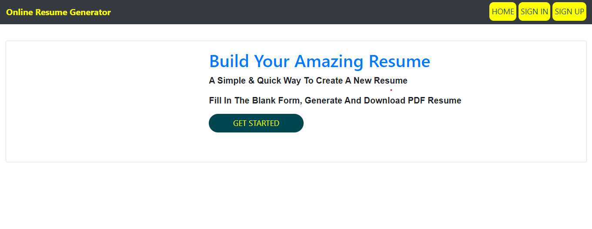
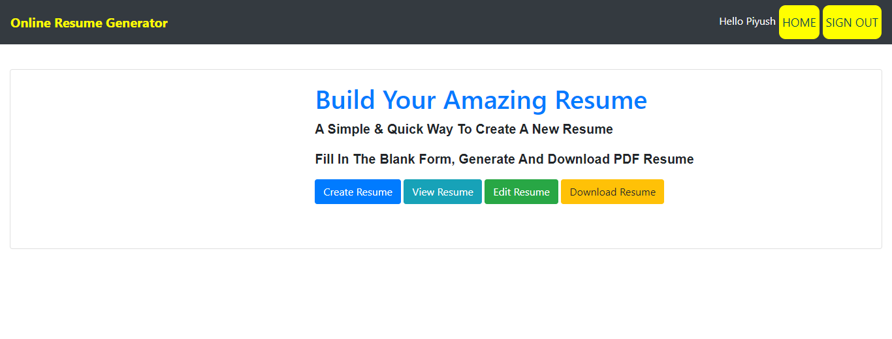
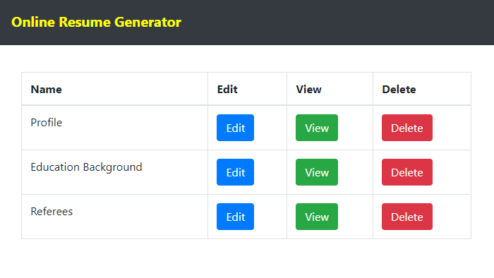
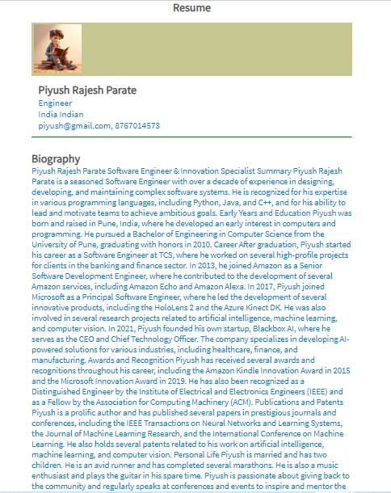

# Resume-Builder

A simple, responsive resume/CV builder that lets users fill in their details and generate a printable/resumable resume. This project is primarily built with CSS and HTML, with a small Python component for optional backend/export functionality.

Repository: https://github.com/piyush2004parate/Resume-Builder

## Features

- Clean, responsive resume layout designed with HTML and CSS
- Live preview of the resume as you fill in details (client-side)
- Print-friendly styles for PDF export using browser print or print-to-PDF
- Optional Python backend for advanced export (if present in the repo)

## Screenshots

Below are screenshots showing the app UI and a sample generated resume. The images for the screenshots live in the repository at `static/img`. If you prefer the images to live under a different path, update the `src` values below accordingly.

- Landing / Get Started view  


- Landing / action buttons  


- Sections list with Edit / View / Delete actions  


- Generated resume / PDF preview  


(If your image filenames differ, rename them or update the paths above. The UI screenshots you provided were numbered 1–4; I used screenshot-1.png .. screenshot-4.png as the filenames.)

## Tech stack

- CSS (primary) — styling and responsive layout
- HTML — structure and forms
- Python (optional) — backend utilities or export scripts

## Quick demo / Usage

There are two common ways to run the project locally:

1. Static preview (no server required)
   - Clone the repo:
     ```bash
     git clone https://github.com/piyush2004parate/Resume-Builder.git
     cd Resume-Builder
     ```
   - Open `index.html` in your browser to preview and use the builder.

2. Serve locally with a simple HTTP server (recommended for form POSTs or local fetch)
   - Python 3 (from the project root):
     ```bash
     python -m http.server 8000
     ```
   - Then open http://localhost:8000 in your browser.

3. Optional Python backend (if the repository contains a backend application)
   - If there is a backend folder or an `app.py` and a `requirements.txt`, install dependencies and run the app:
     ```bash
     python -m venv venv
     source venv/bin/activate   # Windows: venv\Scripts\activate
     pip install -r requirements.txt
     python app.py
     ```

## How to add or update screenshots

1. Place the four screenshots in the repository under `static/img/` and name them:
   - `screenshot-1.png`
   - `screenshot-2.png`
   - `screenshot-3.png`
   - `screenshot-4.png`

   Example local steps:
   ```bash
   mkdir -p static/img
   # copy or move your images into static/img and rename them accordingly
   git add static/img/screenshot-*.png README.md
   git commit -m "Add screenshots and update README"
   git push
   ```

2. If you prefer to use a different filename or directory, edit the `src` attributes in the "Screenshots" section above to match.

## Customization

- Modify styling in the CSS files (e.g., `styles.css`) to change fonts, colors, spacing, or layout.
- Update HTML templates to add or remove sections.
- Add more export options (e.g., server-side PDF generation) if you include or build a Python backend using libraries like WeasyPrint, wkhtmltopdf, ReportLab, or Playwright.

## Accessibility & Printing tips

- Use semantic HTML elements and accessible form labels for better screen reader support.
- Test print layout with different browser print scales; adjust page-break rules in CSS for long sections.

## Contributing

Contributions are welcome. To contribute:

1. Fork the repository.
2. Create a feature branch: `git checkout -b feat/my-change`
3. Make your changes and commit: `git commit -m "Add feature"`
4. Push and open a Pull Request against the `main` branch.

Please include screenshots or steps to reproduce if you open issues or PRs that change UI behavior.

## Issues & feature requests

Please use the repository’s Issues tab to report bugs or request new features. Provide steps to reproduce, expected vs. actual behavior, and relevant screenshots.

## License

If a LICENSE file is not included, consider adding one (MIT recommended for open source). Example header:

```
MIT License
Copyright (c) 2025 piyush2004parate
```

## Acknowledgements

Thanks for checking out Resume-Builder. If you have suggestions (UI improvements, templates, export features), open an issue or submit a PR.

Maintainers / Contact
- Owner: piyush2004parate
- Repo: https://github.com/piyush2004parate/Resume-Builder
